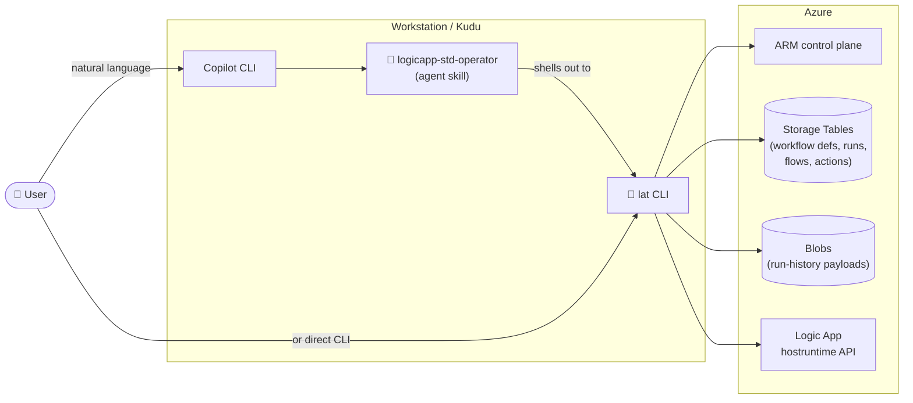

# Logic App Standard Advanced Tools

[](https://opensource.org/licenses/MIT)
[](https://www.python.org/downloads/)
[](python-port/tests/)

A **Python CLI** (`lat`) and a matching **Copilot CLI agent skill** for
diagnosing, recovering, and operating **Azure Logic Apps Standard**
deployments at a level below what the Azure portal exposes.

> 📜 This project started as a fork of the .NET 8
> [`LogicAppAdvancedTool`](https://github.com/microsoft/Logic-App-STD-Advanced-Tools).
> The Python port (`lat`) is a complete re-implementation with
> byte-for-byte parity on hashing/compression plus Entra ID storage
> support the original lacked. **The project has standardized on
> Python**; the original .NET source is preserved under
> [`archive/dotnet/`](archive/dotnet/) for reference only.

---

## 1. What this is

`lat` operates Logic Apps Standard at the **storage / ARM** layer, which
the Azure portal cannot reach. Use it to:

- 🛟 **Restore a deleted workflow** — the runtime keeps definitions for
  ~90 days in a storage table; `lat` reads them back.
- ⏪ **Roll back to any historical version** — read any `FLOWVERSION`
  row, decompress, write back.
- 🧯 **Triage failed runs at scale** — bulk-dump every failure on a
  date, search payloads for keywords, emit Azure-portal monitor URLs.
- 🩺 **Diagnose connectivity** — DNS + TCP + auth probe storage
  endpoints, Service Providers, any HTTP endpoint.
- 📸 **Snapshot + restore** entire `wwwroot` + app settings before a
  risky deploy.
- 🧹 **Clean up old run history** to control storage cost.
- 🔓 **Whitelist Azure Connector IPs** in a downstream Storage / Key
  Vault / Event Hub firewall.

There's also a **Copilot CLI agent skill** (`logicapp-std-operator`)
that drives `lat` in plain English (English + 中文 prompts), with
safety rails on every destructive command:

> *"Help — I accidentally deleted a workflow called `OrderProcessing`.
> Can I get it back?"*

The skill picks the right playbook, asks before any irreversible
action, and supports classic .NET command names
(`RestoreSingleWorkflow`, `BatchResubmit`, etc.) as aliases.

---

## 2. Architecture



### Repository layout

```text
LogicAppStandard-AdvancedTool-Skills/
├── .github/skills/logicapp-std-operator/   # 🤖 Copilot CLI agent skill (active)
│   ├── SKILL.md                            #   YAML frontmatter + skill prompt
│   ├── playbooks/                          #   9 playbooks (restore / triage / ...)
│   ├── references/                         #   prefix algorithm, table schema, ...
│   ├── command-safety-matrix.md            #   per-command safety class
│   └── install.{ps1,sh}                    #   self-bundled installer
│
├── python-port/                            # 🐍 lat CLI (the only active impl)
│   ├── src/lat/                            #   41 commands across 6 sub-apps
│   ├── tests/                              #   299 unit tests
│   ├── README.md                           #   deep-dive docs
│   └── MIGRATION-NOTES.md                  #   intentional deltas vs. .NET tool
│
├── release/                                # 📦 One-click installers
│   ├── install-all.{ps1,sh}                #   lat venv + skill
│   ├── install-lat.{ps1,sh}                #   just the CLI
│   ├── install-skill.{ps1,sh}              #   just the agent skill
│   └── README.md
│
├── archive/                                # 📚 Historical material
│   ├── dotnet/                             #   the original .NET 8 source
│   ├── skills/logicapp-std-tool-python-port/   # the porting skill (drove migration)
│   └── readme_old.md
│
└── README.md                               # ← this file
```

---

## 3. Command reference

### 3a. Agent playbooks (Copilot CLI skill)

The agent triggers automatically when the user says any of:

| User says... | Playbook |
| --- | --- |
| "my workflow is gone / was deleted / I need it back" | [`restore-deleted-workflow.md`](.github/skills/logicapp-std-operator/playbooks/restore-deleted-workflow.md) |
| "run X failed", "lots of runs failed today", "find why a run failed" | [`triage-failed-runs.md`](.github/skills/logicapp-std-operator/playbooks/triage-failed-runs.md) |
| "can't connect to storage", "DNS resolves but auth fails", "NSP blocked" | [`diagnose-storage-issue.md`](.github/skills/logicapp-std-operator/playbooks/diagnose-storage-issue.md) |
| "delete old run history", "storage cost is high" | [`safe-cleanup.md`](.github/skills/logicapp-std-operator/playbooks/safe-cleanup.md) |
| "back up before a risky change", "snapshot the site", "roll back the site" | [`snapshot-and-rollback.md`](.github/skills/logicapp-std-operator/playbooks/snapshot-and-rollback.md) |
| "rerun a batch of failed runs", "cancel runs stuck in Running" | [`bulk-resubmit-or-cancel.md`](.github/skills/logicapp-std-operator/playbooks/bulk-resubmit-or-cancel.md) |
| "merge run history into another workflow", "I recreated the workflow with the same name" | [`merge-run-history.md`](.github/skills/logicapp-std-operator/playbooks/merge-run-history.md) |
| "connector calls fail with `AuthorizationFailure`, target is firewalled" | [`unblock-connector-firewall.md`](.github/skills/logicapp-std-operator/playbooks/unblock-connector-firewall.md) |
| anything else, or general health-check / "is this LA OK?" | [`diagnostic-first.md`](.github/skills/logicapp-std-operator/playbooks/diagnostic-first.md) |

Every `lat` command is classified into one of 4 safety tiers; the agent
**always asks for confirmation** before running anything in the ⚠️ or
⛔ tier:

| Class | Meaning | Confirmation required? |
| --- | --- | --- |
| ✅ **Safe** | Read-only, idempotent, no side effects | No |
| 📁 **Local-write** | Writes to a local folder; Azure unchanged | No (warns on overwrite) |
| ⚠️ **Destructive (recoverable)** | Modifies Azure state; recoverable from snapshot/backup | **Yes** |
| ⛔ **Irreversible** | Modifies/deletes Azure state with no automated undo | **Yes + recent backup required** |

Full per-command matrix:
[`command-safety-matrix.md`](.github/skills/logicapp-std-operator/command-safety-matrix.md).

### 3b. `lat` CLI commands

41 commands across 6 sub-apps. Run `lat <sub-app> --help` for the full
list and `lat <sub-app> <command> --help` for options.

| Sub-app | Command | Description |
| --- | --- | --- |
| `workflow` | `backup` | Retrieve all definitions in the storage table and save as JSON. Also dumps `appsettings.json` via ARM. The table keeps deleted workflows for 90 days. |
| `workflow` | `decode` | Decode a workflow's `DefinitionCompressed` for a specific version to JSON on stdout. |
| `workflow` | `clone` | Clone a workflow into a new folder under `wwwroot` (optionally pin to a specific version). |
| `workflow` | `convert-to-stateful` | Clone the FLOWIDENTIFIER row of a workflow into a new folder. |
| `workflow` | `revert` | Revert a workflow's `workflow.json` to a previous version. |
| `workflow` | `restore-workflow-with-version` | Restore a deleted workflow at a chosen version, dump its `RuntimeContext_*.json` (API-connection metadata). |
| `workflow` | `ingest-workflow` | **Experimental.** Force-update storage tables with a locally-edited `workflow.json`, bypassing validation. |
| `workflow` | `merge-run-history` | **Destructive.** When a workflow was deleted and recreated with the same name, re-key the deleted workflow's history to the new FlowId. Irreversible. |
| `workflow` | `list-workflows` | Interactive 3-level drill-down (name → FlowId → version) over every workflow ever seen by the storage table (includes deleted). |
| `workflow` | `list-workflows-summary` | Non-interactive: one row per workflow name. |
| `workflow` | `list-versions` | List every saved version (FLOWVERSION row) for a workflow. |
| `runs` | `retrieve-failures-by-date` | Dump every failure action on a given date to JSON. Filters control-action cascades. |
| `runs` | `retrieve-failures-by-run` | Dump every failure action of a single run id (looks up run date automatically). |
| `runs` | `retrieve-action-payload` | Dump inputs/outputs of a specific action or trigger on a date. |
| `runs` | `search-in-history` | Search inlined action payloads on a date for a keyword; emit matching run ids + grouped JSON. |
| `runs` | `generate-run-history-url` | Emit Azure-portal monitor URLs for failed runs on a date, optionally filtered by payload / error / status-code keyword. |
| `runs` | `batch-resubmit` | Bulk resubmit runs by status + date range. Throttle-aware (50 / 5 min). |
| `runs` | `cancel-runs` | **Destructive.** Cancel every Running / Waiting run of a workflow by writing `Status=Cancelled` directly. Causes data loss. |
| `cleanup` | `containers` | Delete run-history blob containers older than a given date. |
| `cleanup` | `tables` | Delete run-history `*actions` / `*variables` storage tables older than a given date. |
| `cleanup` | `run-history` | Composite: tables + containers in one pass. |
| `validate` | `endpoint` | DNS + TCP + SSL handshake check for any HTTP(S) endpoint. |
| `validate` | `storage-connectivity` | DNS + TCP + auth probe for every backing storage service endpoint (Blob/Queue/Table/File). |
| `validate` | `sp-connectivity` | DNS + TCP probe for every Service Provider declared in `connections.json`. |
| `validate` | `workflows` | Runtime-validate every `workflow.json` under wwwroot via the Logic App hostruntime API. Catches errors the design-time portal validator misses. |
| `validate` | `scan-connections` | List connections (API connections + Service Providers) declared in `connections.json` but not used by any workflow. `--apply` removes them. |
| `validate` | `whitelist-connector-ip` | Add the regional Azure Connector IP range to a Storage / Key Vault / Event Hub firewall. |
| `site` | `snapshot-create` | Snapshot `wwwroot` + app settings to a local folder. |
| `site` | `snapshot-restore` | Restore `wwwroot` + push app settings from a snapshot folder. |
| `site` | `sync-to-local-normal` | Interactive sync of `wwwroot` to a local folder. |
| `site` | `sync-to-local-auto` | Non-interactive sync (deletes non-excluded local subfolders first). |
| `site` | `sync-to-local-batch` | Run Auto mode against many Logic Apps from a JSON config. |
| `site` | `filter-host-logs` | Grab error / warning lines from `\LogFiles\Application\Functions\Host\`. |
| `tools` | `generate-prefix` | Offline Murmur prefix calculation (no table lookup). |
| `tools` | `generate-table-prefix` | Resolve a workflow name to its runtime storage prefix (LA prefix + workflow prefix + combined). |
| `tools` | `runid-to-datetime` | Decode workflow start time from a run ID. |
| `tools` | `decode-zstd` | Decode a base64-encoded ZSTD blob to text (debug helper). |
| `tools` | `get-mi-token` | Acquire and print a Managed Identity / az-login bearer token. |
| `tools` | `restart` | Restart the Logic App site via ARM. |
| `tools` | `import-appsettings` | Import an app-settings JSON as machine env vars (Windows admin). |
| `tools` | `clean-environment-variable` | Remove env vars listed in an appsettings JSON (Windows admin). |

For complete usage with option-level docs, see
[`python-port/README.md`](python-port/README.md).

---

## 4. Installation

### One-click (recommended)

```powershell
# Windows
git clone https://github.com/dengyanbo/LogicAppStandard-AdvancedTool-Skills.git
cd LogicAppStandard-AdvancedTool-Skills
.\release\install-all.ps1
```

```bash
# Linux / Mac
git clone https://github.com/dengyanbo/LogicAppStandard-AdvancedTool-Skills.git
cd LogicAppStandard-AdvancedTool-Skills
./release/install-all.sh
```

That installs **both**:

- `lat` Python CLI into a venv at `python-port/.venv/`
- The `logicapp-std-operator` agent skill into `~/.agents/skills/`

### Just the skill (if you already have `lat`)

```powershell
.\release\install-skill.ps1     # Windows
./release/install-skill.sh      # Linux / Mac
```

### Just `lat` (if you don't use Copilot CLI)

```powershell
.\release\install-lat.ps1       # Windows
./release/install-lat.sh        # Linux / Mac
```

See [`release/README.md`](release/README.md) for flags (`-Force`,
`-ForceVenv`, `-Python <interp>`, `TARGET=<path>`, ...).

### Post-install: connect to your Logic App

Set the same env vars the Logic App runtime reads. On a workstation:

```powershell
$env:WEBSITE_SITE_NAME      = "MyLogicApp"
$env:WEBSITE_RESOURCE_GROUP = "my-rg"
$env:REGION_NAME            = "Australia East"

# Entra ID storage (modern):
$env:AzureWebJobsStorage__accountName    = "mystorage"
$env:AzureWebJobsStorage__tableServiceUri = "https://mystorage.table.core.windows.net/"
$env:AzureWebJobsStorage__blobServiceUri  = "https://mystorage.blob.core.windows.net/"

# OR conn-string storage (legacy):
# $env:AzureWebJobsStorage = "DefaultEndpointsProtocol=https;AccountName=...;AccountKey=...;..."
```

Then `az login` once and:

```powershell
.\python-port\.venv\Scripts\Activate.ps1
lat workflow list-workflows-summary
```

To use the agent skill instead:

```powershell
copilot           # opens Copilot CLI; skill auto-loads
/env              # confirm logicapp-std-operator is loaded
```

---

## License

MIT.

---

<details>
<summary><b>🇨🇳 中文版（点击展开）</b></summary>

# Logic App Standard 高级工具

一套**Python CLI**（`lat`）+ 对应的 **Copilot CLI Agent Skill**，用于
诊断、恢复、运维 **Azure Logic Apps Standard**——能力覆盖 Azure 门户
够不到的存储 / ARM 底层。

> 📜 本项目最初 fork 自 .NET 8 版的
> [`LogicAppAdvancedTool`](https://github.com/microsoft/Logic-App-STD-Advanced-Tools)。
> Python 移植版（`lat`）是一次完整重写：在哈希 / 压缩算法上保持
> 字节级一致，并增加了原版欠缺的 Entra ID 存储支持。**项目目前以
> Python 为唯一活跃实现**，原 .NET 源码已归档至
> [`archive/dotnet/`](archive/dotnet/) 仅供参考。

---

## 1. 项目简介

`lat` 在 **存储 / ARM 层** 操作 Logic Apps Standard（Azure 门户做不到的层级），可以：

- 🛟 **恢复被删除的工作流** —— 运行时会把定义在存储表里保留约 90 天，`lat` 把它读回来。
- ⏪ **回滚到任意历史版本** —— 读取任一 `FLOWVERSION` 行、解压、写回。
- 🧯 **批量分流失败运行** —— 一键 dump 某天全部失败 action，按关键字搜索 payload，生成门户 monitor URL。
- 🩺 **连通性诊断** —— 对存储 endpoint、Service Provider、任意 HTTP endpoint 做 DNS + TCP + 认证探测。
- 📸 **快照 / 还原** 整个 `wwwroot` 和 app settings，在高风险部署前用。
- 🧹 **清理历史运行记录** 控制存储成本。
- 🔓 **加白 Azure Connector IP** 到下游 Storage / Key Vault / Event Hub 防火墙。

另有一个 **Copilot CLI Agent Skill**（`logicapp-std-operator`），可以用
自然语言（中英文均支持）驱动 `lat`，所有破坏性操作前必先确认：

> *"救命，我刚才误删了一个叫 `OrderProcessing` 的工作流，能恢复吗？"*

Skill 会自动挑选合适的 playbook、对不可逆操作要求二次确认，
并支持原 .NET 命令名（`RestoreSingleWorkflow`、`BatchResubmit` 等）作为别名。

---

## 2. 架构概览

参考上方英文版 Mermaid 图。组件关系：

- **用户** 用自然语言对话 → **Copilot CLI** → **logicapp-std-operator Skill** → **`lat` CLI** → **Azure**（ARM / 存储表 / Blob / hostruntime）
- 也可绕过 Copilot，直接命令行调用 `lat`。

### 仓库目录

```text
LogicAppStandard-AdvancedTool-Skills/
├── .github/skills/logicapp-std-operator/   # 🤖 Copilot CLI Agent Skill（活跃）
├── python-port/                            # 🐍 lat CLI（唯一活跃实现，299 单元测试）
├── release/                                # 📦 一键安装脚本（PS + bash）
├── archive/                                # 📚 历史归档（原 .NET 源码、移植 Skill）
└── README.md                               # ← 本文件
```

---

## 3. 命令清单

### 3a. Agent Playbooks（Copilot CLI Skill）

用户说出以下任意意图时，Skill 自动触发：

| 用户说... | 调用的 Playbook |
| --- | --- |
| "工作流不见了 / 被删了 / 帮我找回来" | [`restore-deleted-workflow.md`](.github/skills/logicapp-std-operator/playbooks/restore-deleted-workflow.md) |
| "X 运行失败了 / 今天一堆运行失败了 / 查一下原因" | [`triage-failed-runs.md`](.github/skills/logicapp-std-operator/playbooks/triage-failed-runs.md) |
| "连不上存储 / DNS 通了认证失败 / NSP 拦了" | [`diagnose-storage-issue.md`](.github/skills/logicapp-std-operator/playbooks/diagnose-storage-issue.md) |
| "清理旧的运行记录 / 存储费用太高了" | [`safe-cleanup.md`](.github/skills/logicapp-std-operator/playbooks/safe-cleanup.md) |
| "改动前备份一下 / 给整个站点拍快照 / 整站回滚" | [`snapshot-and-rollback.md`](.github/skills/logicapp-std-operator/playbooks/snapshot-and-rollback.md) |
| "批量重跑失败的运行 / 取消卡在 Running 的运行" | [`bulk-resubmit-or-cancel.md`](.github/skills/logicapp-std-operator/playbooks/bulk-resubmit-or-cancel.md) |
| "把运行历史并到另一个工作流里 / 同名重建后历史没了" | [`merge-run-history.md`](.github/skills/logicapp-std-operator/playbooks/merge-run-history.md) |
| "Connector 调用返回 AuthorizationFailure，下游有防火墙" | [`unblock-connector-firewall.md`](.github/skills/logicapp-std-operator/playbooks/unblock-connector-firewall.md) |
| 其他 / 通用健康检查 / "这个 LA 还好吗？" | [`diagnostic-first.md`](.github/skills/logicapp-std-operator/playbooks/diagnostic-first.md) |

所有 `lat` 命令被分入四级安全等级；⚠️ 与 ⛔ 级别 **必须用户显式确认**才能执行：

| 等级 | 含义 | 是否需要确认 |
| --- | --- | --- |
| ✅ **Safe** | 只读、幂等，无副作用 | 否 |
| 📁 **Local-write** | 只写本地文件，Azure 状态不变 | 否（覆盖时会警告） |
| ⚠️ **Destructive (recoverable)** | 改 Azure 状态，但能从快照/备份恢复 | **是** |
| ⛔ **Irreversible** | 改 / 删 Azure 状态，无法自动撤销 | **是 + 须有近期备份** |

完整每条命令的安全矩阵见 [`command-safety-matrix.md`](.github/skills/logicapp-std-operator/command-safety-matrix.md)。

### 3b. `lat` CLI 命令

6 个子命令组、共 41 条命令。`lat <sub-app> --help` 查列表，`lat <sub-app> <command> --help` 查选项。

| 子命令组 | 命令 | 说明 |
| --- | --- | --- |
| `workflow` | `backup` | 拉取存储表内所有定义存为 JSON，并通过 ARM 导出 `appsettings.json`。存储表会保留被删工作流约 90 天。 |
| `workflow` | `decode` | 把某一版本的 `DefinitionCompressed` 解码为可读 JSON 输出到 stdout。 |
| `workflow` | `clone` | 把工作流克隆到 `wwwroot` 下的新文件夹（可选指定某版本）。 |
| `workflow` | `convert-to-stateful` | 把某工作流的 FLOWIDENTIFIER 行克隆到新文件夹。 |
| `workflow` | `revert` | 把工作流的 `workflow.json` 回滚到之前的版本。 |
| `workflow` | `restore-workflow-with-version` | 按选定版本恢复已删除工作流，并 dump 其 `RuntimeContext_*.json`（API connection 元数据）。 |
| `workflow` | `ingest-workflow` | **实验性**。绕过定义校验，把本地修改过的 `workflow.json` 强制写回存储表。 |
| `workflow` | `merge-run-history` | **破坏性**。当工作流被删后又同名重建会丢失历史，本命令把旧 FlowId 的历史 re-key 到新 FlowId。不可逆。 |
| `workflow` | `list-workflows` | 交互式三层钻取（名称 → FlowId → 版本），遍历存储表见过的所有工作流（含已删除）。 |
| `workflow` | `list-workflows-summary` | 非交互：每个工作流名一行。 |
| `workflow` | `list-versions` | 列出某工作流的所有保存版本（FLOWVERSION 行）。 |
| `runs` | `retrieve-failures-by-date` | 把某一天的全部失败 action dump 为 JSON。过滤掉只因子 action 失败而连带失败的 control action。 |
| `runs` | `retrieve-failures-by-run` | dump 某一次运行的全部失败 action（自动定位运行所在日期）。 |
| `runs` | `retrieve-action-payload` | dump 某天某条 action / trigger 的 inputs / outputs。 |
| `runs` | `search-in-history` | 在某天的 inlined payload 中按关键字搜索；输出命中 run id 及按 run 聚合的 JSON。 |
| `runs` | `generate-run-history-url` | 为某天的失败运行生成 Azure 门户 monitor URL，可按 payload / error / 状态码关键字过滤。 |
| `runs` | `batch-resubmit` | 按状态 + 日期范围批量重跑。已做节流（50 次 / 5 分钟）。 |
| `runs` | `cancel-runs` | **破坏性**。直接把工作流所有 Running / Waiting 的运行写为 `Status=Cancelled`。会造成数据丢失。 |
| `cleanup` | `containers` | 删除某日期之前的运行历史 blob container。 |
| `cleanup` | `tables` | 删除某日期之前的运行历史 `*actions` / `*variables` 存储表。 |
| `cleanup` | `run-history` | 组合命令：表 + container 一并清理。 |
| `validate` | `endpoint` | 任意 HTTP(S) 端点的 DNS + TCP + SSL 握手检查。 |
| `validate` | `storage-connectivity` | 对底层每个存储服务端点（Blob/Queue/Table/File）做 DNS + TCP + 认证探测。 |
| `validate` | `sp-connectivity` | 对 `connections.json` 里声明的每个 Service Provider 做 DNS + TCP 探测。 |
| `validate` | `workflows` | 通过 hostruntime API 对 `wwwroot` 下每个 `workflow.json` 做运行时校验。能查出门户设计器校不出来的问题。 |
| `validate` | `scan-connections` | 列出 `connections.json` 里声明却没被任何工作流引用的 connection。`--apply` 可一并清理。 |
| `validate` | `whitelist-connector-ip` | 把当前区域的 Azure Connector IP 段加白到下游 Storage / Key Vault / Event Hub 防火墙。 |
| `site` | `snapshot-create` | 把 `wwwroot` + appsettings 快照到本地文件夹。 |
| `site` | `snapshot-restore` | 从快照恢复 `wwwroot` 并推回 appsettings。 |
| `site` | `sync-to-local-normal` | 交互式拉取 `wwwroot` 到本地（从内容文件共享）。 |
| `site` | `sync-to-local-auto` | 非交互拉取（先删本地非 exclude 的子目录）。 |
| `site` | `sync-to-local-batch` | 用 JSON 配置批量对多个 Logic App 跑 auto 模式。 |
| `site` | `filter-host-logs` | 从 `\LogFiles\Application\Functions\Host\` 提取 error / warning 行。 |
| `tools` | `generate-prefix` | 离线 Murmur prefix 计算（不查表）。 |
| `tools` | `generate-table-prefix` | 把工作流名解析为运行时存储 prefix（LA prefix + workflow prefix + 拼接结果）。 |
| `tools` | `runid-to-datetime` | 从 run id 反推工作流启动时间。 |
| `tools` | `decode-zstd` | 把 base64 + ZSTD 编码的 blob 解码为文本（调试用）。 |
| `tools` | `get-mi-token` | 取一个 Managed Identity / az-login bearer token 并打印。 |
| `tools` | `restart` | 通过 ARM 重启 Logic App。 |
| `tools` | `import-appsettings` | 把 appsettings JSON 导入为机器级环境变量（Windows 管理员）。 |
| `tools` | `clean-environment-variable` | 反向操作：移除 appsettings JSON 列出的环境变量（Windows 管理员）。 |

完整用法、选项级文档见 [`python-port/README.md`](python-port/README.md)。

---

## 4. 安装说明

### 一键安装（推荐）

```powershell
# Windows
git clone https://github.com/dengyanbo/LogicAppStandard-AdvancedTool-Skills.git
cd LogicAppStandard-AdvancedTool-Skills
.\release\install-all.ps1
```

```bash
# Linux / Mac
git clone https://github.com/dengyanbo/LogicAppStandard-AdvancedTool-Skills.git
cd LogicAppStandard-AdvancedTool-Skills
./release/install-all.sh
```

会**同时**装好：

- `lat` Python CLI 到 `python-port/.venv/` 的 venv 里
- `logicapp-std-operator` Agent Skill 到 `~/.agents/skills/`

### 只装 Skill（已经有 `lat` 时）

```powershell
.\release\install-skill.ps1     # Windows
./release/install-skill.sh      # Linux / Mac
```

### 只装 `lat`（不用 Copilot CLI 时）

```powershell
.\release\install-lat.ps1       # Windows
./release/install-lat.sh        # Linux / Mac
```

所有脚本均支持参数：`-Force`、`-ForceVenv`、`-Python <解释器>`、
`TARGET=<目录>` 等，详情见 [`release/README.md`](release/README.md)。

### 安装后：连接你的 Logic App

跟 Logic App 运行时读的是同一组环境变量。在工作站上：

```powershell
$env:WEBSITE_SITE_NAME      = "MyLogicApp"
$env:WEBSITE_RESOURCE_GROUP = "my-rg"
$env:REGION_NAME            = "Australia East"

# Entra ID 存储（新方式）：
$env:AzureWebJobsStorage__accountName    = "mystorage"
$env:AzureWebJobsStorage__tableServiceUri = "https://mystorage.table.core.windows.net/"
$env:AzureWebJobsStorage__blobServiceUri  = "https://mystorage.blob.core.windows.net/"

# 或连接字符串存储（旧方式）：
# $env:AzureWebJobsStorage = "DefaultEndpointsProtocol=https;AccountName=...;AccountKey=...;..."
```

执行一次 `az login`，然后：

```powershell
.\python-port\.venv\Scripts\Activate.ps1
lat workflow list-workflows-summary
```

或者用 Agent Skill：

```powershell
copilot           # 启动 Copilot CLI，skill 会自动加载
/env              # 确认 logicapp-std-operator 已加载
```

---

## License

MIT.

</details>
